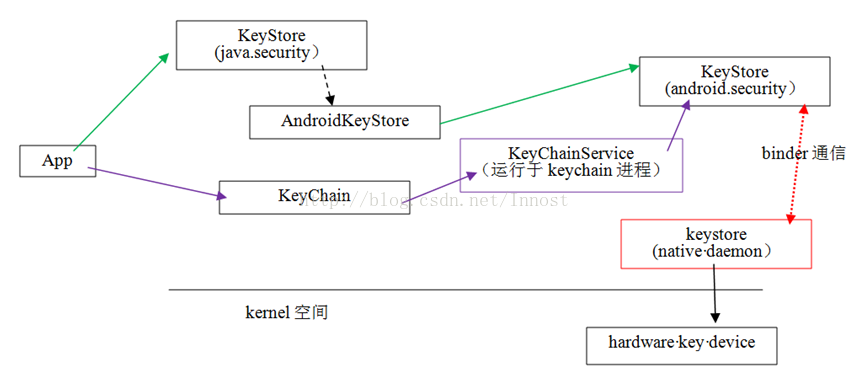

# Keychain

Google Android 官方文档：

> 在需要系统级凭据时请使用 [KeyChain](https://developer.android.com/reference/android/security/KeyChain.html?hl=zh-cn) API。在应用通过 KeyChain API 请求使用任何凭据时，用户需要通过系统提供的 UI 选择应用可以访问已安装的哪些凭据。因此，在用户同意的情况下多个应用可以使用同一套凭据。

所以如果需要系统级别的 key，可以使用 KeyChain API，具体实现可以详见 [KeyChainDemo](https://github.com/Miserlou/Android-SDK-Samples/tree/master/KeyChainDemo)